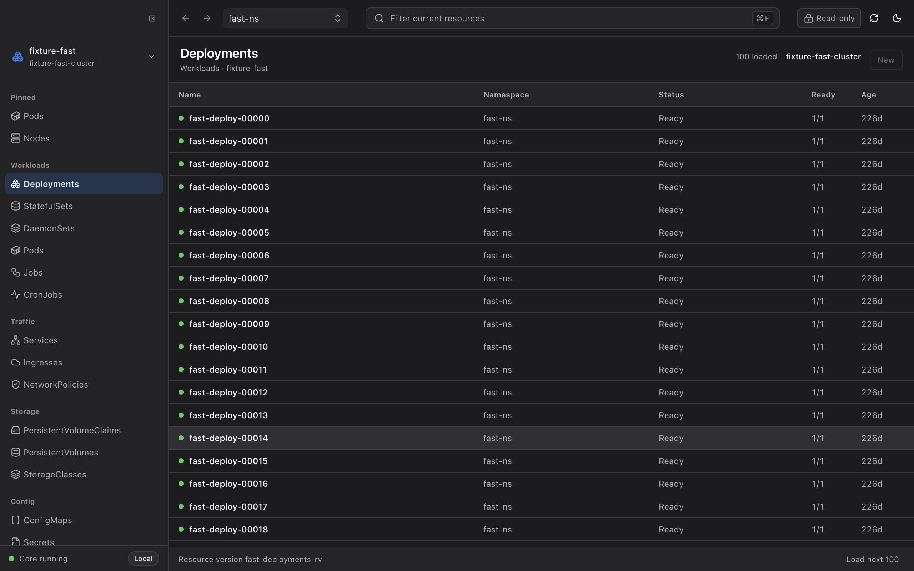

<h1 align="center">Aster</h1>

<p align="center">
  <b>A 28 MB Kubernetes desktop client. Keyboard-first, local-only, no account.</b>
</p>

<p align="center">
  <a href="README.md"><b>English</b></a> · <a href="README.zh-CN.md">简体中文</a>
</p>

<p align="center">
  <a href="https://github.com/zjy365/aster/releases"></a>
  <a href="LICENSE"></a>
  
  
</p>

<p align="center">
  
</p>

Aster is a Kubernetes desktop client built for the thing you actually do fifty times a day: open it, find one resource, look at it, close it.

It ships as a **28 MB download** (63 MB installed) because it is a native Tauri shell talking to a small Go sidecar — not a browser engine with a control plane bolted on. It has **no account, no telemetry, and no backend**. It reads your kubeconfig and talks straight to your cluster's API server.

## Why another one

| | Aster |
|---|---|
| **Download size** | 28 MB |
| **Runtime** | Native shell (Tauri 2 + Rust) + Go sidecar. No Chromium bundle. |
| **Navigation** | `⌘K` for everything — clusters, resource kinds, namespaces, cluster-wide search |
| **Large clusters** | Native server-side pagination + scoped watches + virtualized tables. Never "load all". |
| **Logs** | Live streaming into a real terminal emulator — ANSI colors, level highlighting, `⌘F` in-buffer search |
| **Workload logs** | One merged stream across a Deployment's pods, interleaved by timestamp |
| **Many clusters** | Point it at kubeconfig files *and* directories; the picker groups contexts by which file they came from |
| **Your credentials** | Never reach the UI layer. No kubeconfig contents, no Secret values, no tokens. |
| **Your data** | Never leaves your machine. No account, no telemetry, no remote service. |
| **Permissions** | Exactly what's already in your kubeconfig. Aster never creates a ServiceAccount or ClusterRole for its own convenience. |

## Install

Download the build for your platform from [**Releases**](https://github.com/zjy365/aster/releases):

| Platform | File |
|---|---|
| macOS (Apple Silicon) | `Aster_x.y.z_aarch64.dmg` |
| macOS (Intel) | `Aster_x.y.z_x64.dmg` |
| Windows | `Aster_x.y.z_x64-setup.exe` |
| Linux | `.AppImage` / `.deb` |

Then open it. There is no sign-up step — if `kubectl` works on your machine, Aster works.

<details>
<summary>Build from source</summary>

Requires Node.js 22.19+, pnpm 10.12.2, Go 1.26+, and Rust stable.

```bash
pnpm install
pnpm dist
```
</details>

## Keyboard

Aster is designed so your hands don't leave the keyboard. Menus are a fallback, not the path.

| Key | Action |
|---|---|
| `⌘K` / `Ctrl+K` | Command palette — switch cluster, jump to any resource kind, switch namespace, search the cluster by name, change theme |
| `⌘F` / `Ctrl+F` | Filter the current resource list |
| `↑` `↓` `⏎` | Navigate and open |
| `Esc` | Step back out, one layer at a time |

<p align="center">
  
</p>

## What it does

**Browse and watch** — the common resource catalog (workloads, traffic, storage, config, RBAC, CRDs) with native pagination, label selectors, and scoped watches that reconnect and recover from expired resource versions.

**Find anything** — `⌘K` searches the whole cluster by name. It fans out bounded, parallel list calls across the resource catalog and goes straight to the API server. No informer, no cache, nothing warming up in the background.

**Inspect** — a full detail workspace per resource: Overview, Pods, syntax-highlighted YAML, Events, and owner-reference Related navigation that walks you from a Deployment to its ReplicaSets, Pods, and Services.

**Read logs like a terminal, because it is one** — logs stream live into an xterm surface, not a `<div>`. Your app's own ANSI colors survive; log levels get highlighted; timestamps are dimmed. `⌘F` searches the buffer with match counts. You can switch containers, read the previous container's logs after a crash, filter client-side, and download the buffer. Cursor and erase escape sequences are stripped, so a workload writing garbage to stdout can't corrupt or spoof the viewer.

**One log stream for a whole workload** — pick a Deployment, StatefulSet, DaemonSet, or Job and get its pods merged into a single stream, interleaved by timestamp and tagged by pod. When there are more replicas than an interleaved stream can stay readable at, it samples the newest and tells you it did.

**Bring your own kubeconfig layout** — point Aster at individual files *or* whole directories. Directories are expanded by looking at file contents, not extensions, so the usual `~/.kube/prod-admin` files load without renaming anything. You can disable the standard `$KUBECONFIG` chain entirely and use only your own list. The cluster picker groups contexts by which file they came from, and Settings shows a per-source report of what loaded and what failed.

**Helm** — browse releases, inspect release detail, roll back, and uninstall. Rendered manifests come back with Secret data masked; every other document passes through byte-for-byte so you're reading exactly what the chart produced.

**Cluster overview** — nodes, pods, namespaces, and services at a glance, with ready-counts. Every card is a link into the list behind it.

**Change things, carefully** — update image, restart workloads, edit any writable object's YAML, create, and delete. Every write goes through a server-side dry-run, a semantic diff you have to read, a resource-version conflict check, and an explicit Apply. Every applied change is recorded in a local per-context operation journal (summaries only).

## What it deliberately does not do

These are decisions, not a backlog:

- **No Secret mutation.** Reading is sanitized; writing is disabled.
- **No interactive shell.** There is no `exec` into a pod and no persistent TTY.
- **No global informer cache or startup cache sync.** Clients are created lazily, for the view you actually opened. Launching Aster does not touch your cluster until you ask it to.
- **No cluster aggregation layer.** Aster shows you one context at a time, honestly.
- **No telemetry, accounts, or remote services.** There is no server to send anything to.
- **No privilege escalation as a convenience.** Aster will never create a ServiceAccount, Role, ClusterRole, or binding on your behalf.

## How it works

```text
React renderer → DesktopApi (invoke/events) → Tauri Rust shell → local Go sidecar → Kubernetes API
```

The Rust shell is the only privileged process. The Go sidecar listens on a **random loopback port** behind **one-time bearer authentication**, and creates Kubernetes clients only when a context is actually queried.

The renderer — the part that renders untrusted cluster data — never receives kubeconfig contents, API credentials, Secret values, the sidecar token, or even the sidecar's base URL.

## Contributing

Issues and PRs are welcome. If you hit something on a real cluster, a bug report with your Kubernetes version and the resource kind involved is the most useful thing you can send.

```bash
pnpm typecheck && pnpm test        # renderer + shell
cd core && go test -race ./... && go vet ./...
```

## Acknowledgements

Thanks to [Kite](https://github.com/kite-org/kite) and its contributors for inspiration around Kubernetes resource navigation and workflows.

## License

[Apache 2.0](LICENSE)
