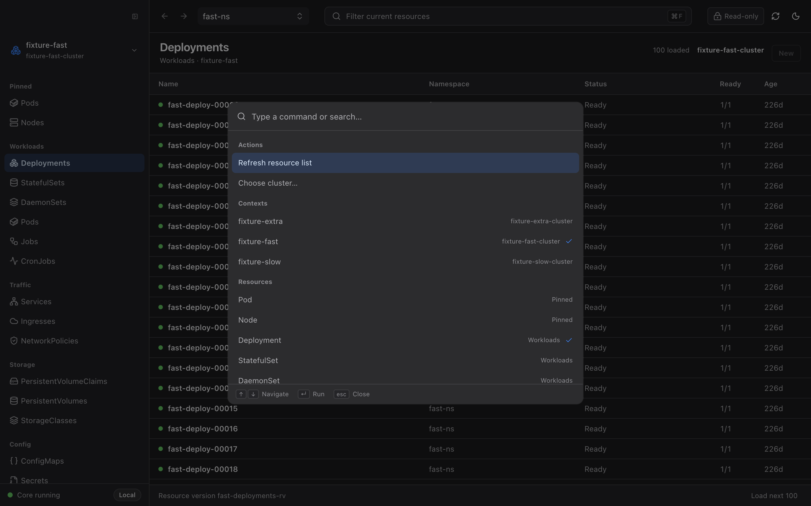

<h1 align="center">Aster</h1>

<p align="center">
  <b>一个 28 MB 的 Kubernetes 桌面客户端。键盘优先，纯本地，不需要账号。</b>
</p>

<p align="center">
  <a href="README.md">English</a> · <b>简体中文</b>
</p>

<p align="center">
  
</p>

Aster 是为你每天要重复五十次的那件事做的：打开、找到某个资源、看一眼、关掉。

安装包 **28 MB**（装完 63 MB），因为它是一个原生 Tauri 壳加一个小的 Go sidecar，不是浏览器内核外面套一层控制台。**没有账号、没有遥测、没有后端服务**——它读你的 kubeconfig，直接和你集群的 API Server 说话。

## 为什么还要再做一个

| | Aster |
|---|---|
| **安装包体积** | 28 MB |
| **运行形态** | 原生壳（Tauri 2 + Rust）+ Go sidecar，不打包 Chromium |
| **导航方式** | 一个 `⌘K` 搞定：切集群、跳资源类型、切 namespace、全集群按名字搜 |
| **大集群** | K8s 原生服务端分页 + scoped watch + 虚拟化表格，绝不一次拉全量 |
| **日志** | 实时流式输出到真正的终端模拟器——保留 ANSI 颜色、日志级别高亮、`⌘F` 缓冲区内搜索 |
| **工作负载日志** | 一个 Deployment 下多个 Pod 的日志按时间戳交错合并成一条流 |
| **多集群** | 可以直接指向 kubeconfig 文件**或整个目录**，集群选择器按来源文件分组 |
| **你的凭据** | 不会进入 UI 层。kubeconfig 内容、Secret 值、sidecar token 都不会传给渲染进程 |
| **你的数据** | 不出这台机器。无账号、无遥测、无远程服务 |
| **权限** | 就是你 kubeconfig 里已有的那些。Aster 绝不会为了方便自己创建 ServiceAccount 或 ClusterRole |

## 安装

从 [**Releases**](https://github.com/zjy365/aster/releases) 下载对应平台的包：

| 平台 | 文件 |
|---|---|
| macOS（Apple Silicon） | `Aster_x.y.z_aarch64.dmg` |
| macOS（Intel） | `Aster_x.y.z_x64.dmg` |
| Windows | `Aster_x.y.z_x64-setup.exe` |
| Linux | `.AppImage` / `.deb` |

打开就能用，没有注册环节。你的 `kubectl` 能用，Aster 就能用。

<details>
<summary>从源码构建</summary>

需要 Node.js 22.19+、pnpm 10.12.2、Go 1.26+ 和 Rust stable。

```bash
pnpm install
pnpm dist
```
</details>

## 快捷键

Aster 的设计前提是手不离开键盘。菜单是退路，不是主路。

| 按键 | 作用 |
|---|---|
| `⌘K` / `Ctrl+K` | 命令面板——切集群、跳到任意资源类型、切 namespace、全集群按名字搜、切主题 |
| `⌘F` / `Ctrl+F` | 在当前资源列表里过滤 |
| `↑` `↓` `⏎` | 上下选择并打开 |
| `Esc` | 一层一层退回去 |

<p align="center">
  
</p>

## 它能做什么

**浏览和监听** —— 常用资源目录（工作负载、流量、存储、配置、RBAC、CRD），走原生分页和 label selector，scoped watch 会自动重连，ResourceVersion 过期会重置恢复。

**找到任何东西** —— `⌘K` 按名字搜索整个集群。它在资源目录上并行发起有上限的 list 请求，直接打到 API Server。没有 informer，没有缓存，后台不会有任何东西在预热。

**查看细节** —— 每个资源都有完整的详情工作区：Overview、Pods、语法高亮的 YAML、Events，以及基于 ownerReferences 的 Related 导航，能从一个 Deployment 一路走到它的 ReplicaSet、Pod 和 Service。

**用终端的方式读日志，因为它本来就是终端** —— 日志实时流式写入 xterm 界面，而不是一个 `<div>`。你自己应用输出的 ANSI 颜色会被保留，日志级别会被高亮，时间戳会被压暗。`⌘F` 在缓冲区内搜索并显示匹配数。可以切容器、在崩溃后读上一个容器的日志、客户端过滤、下载缓冲区内容。光标和擦除类转义序列会被剥掉，所以一个往 stdout 里乱写东西的负载没法破坏或伪造你的日志界面。

**整个工作负载合成一条日志流** —— 选中一个 Deployment、StatefulSet、DaemonSet 或 Job，它下面的 Pod 日志会按时间戳交错合并成一条流，每行标注来自哪个 Pod。副本数多到交错流已经没法读的时候，它会只取最新的几个，并明确告诉你它这么做了。

**用你自己的 kubeconfig 组织方式** —— 可以指定单个文件，也可以直接指定整个目录。目录是按文件**内容**判断的，不看扩展名，所以常见的 `~/.kube/prod-admin` 这种没后缀的文件不用改名就能加载。你也可以完全关掉标准 `$KUBECONFIG` 链，只用自己那份列表。集群选择器会按来源文件分组，设置页里有一份逐来源报告，告诉你哪些加载成功、哪些失败了。

**Helm** —— 浏览 Release、查看详情、回滚、卸载。渲染出的 manifest 里 Secret 数据是打码的，其余文档逐字节原样返回，所以你读到的就是 chart 真正产出的东西。

**集群概览** —— 节点、Pod、命名空间、Service 一眼看完，带就绪数。每张卡片都能点进对应列表。

**改东西，但很小心** —— scale、换镜像、重启、创建资源、编辑 ConfigMap/YAML。每一次写操作都要走服务端 dry-run、一份你必须看的语义化 diff、ResourceVersion 冲突检查，最后手动点 Apply。每次实际应用的变更都会记进本地按 Context 存的操作日志（只存摘要）。

## 它故意不做什么

这些是决定，不是待办：

- **不支持修改 Secret。** 读取是脱敏的，写入直接禁用。
- **没有交互式 shell。** 不提供 exec 进 Pod，也没有常驻 TTY。
- **没有全局 informer 缓存，也没有启动时的缓存同步。** client 懒加载，你打开哪个视图才建。启动 Aster 这个动作本身不会碰你的集群。
- **没有跨集群聚合层。** Aster 一次只诚实地展示一个 context。
- **没有遥测、账号或远程服务。** 根本不存在一个能把数据发过去的服务器。
- **绝不为了方便而提权。** Aster 不会替你创建 ServiceAccount、Role、ClusterRole 或任何绑定。

## 它怎么工作的

```text
React 渲染进程 → DesktopApi（invoke/events）→ Tauri Rust 壳 → 本地 Go sidecar → Kubernetes API
```

Rust 壳是唯一的特权进程。Go sidecar 只监听**随机 loopback 端口**，用**一次性 bearer token** 鉴权，并且只有在某个 context 真的被查询时才创建 Kubernetes client。

渲染进程——也就是负责渲染不可信集群数据的那一层——拿不到 kubeconfig 内容、API 凭据、Secret 值、sidecar token，甚至拿不到 sidecar 的地址。

## 参与贡献

欢迎提 Issue 和 PR。如果你在真实集群上遇到问题，带上 Kubernetes 版本和涉及的资源类型的 bug report 是最有价值的。

```bash
pnpm typecheck && pnpm test        # 渲染进程 + 桌面壳
cd core && go test -race ./... && go vet ./...
```

## 致谢

感谢 [Kite](https://github.com/kite-org/kite) 及其贡献者在 Kubernetes 资源导航与工作流方面提供的启发。

## 许可证

[Apache 2.0](LICENSE)
